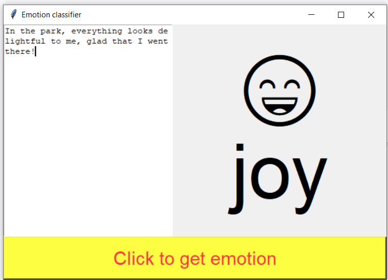
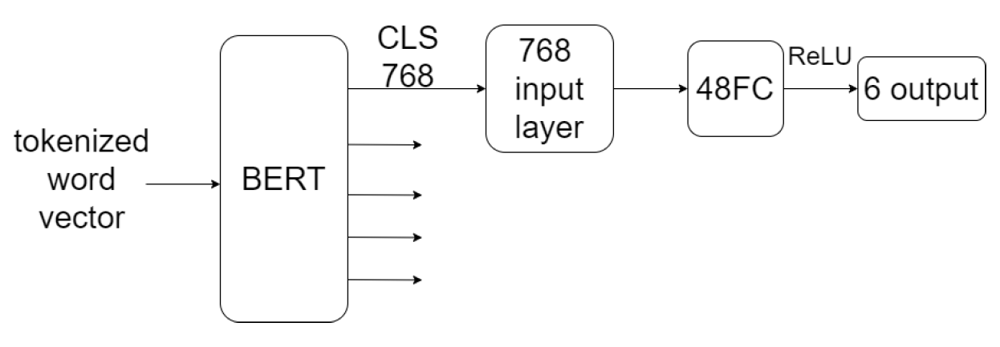

# Fine-tune-bert-base-uncased-for-text-emotional-classifier-with-simple-classifier-with-GUI
# About this project
This is a project including training and evaluate model for text emotion classification by fine tuning bert-base-uncased.

It also including a GUI for showing a emotional emoji for the user's input. The detectable emotion including anger, fear, joy, love, sadness, surprise.

The model is fined tuned from bert-base-uncased by using training dataset from https://www.kaggle.com/datasets/parulpandey/emotion-dataset . Trained for 4 epoch. Be reminded that the dataset is the form of .txt in this project.

On the valdiation dataset, the model can achieve 93.95% of accuracy. The trained model can be downloaded at https://huggingface.co/lrex93497/bert-6-text-emotion-classifier.
Just download the checkpoint.pt .

If you want To train the model and evaluate it afterward, you can use preprocess_and_train_and_evaluate.ipynb . It can train with 6gb vram as the max_lenght is set to 150. At the end it will gives accuracy and loss for the fine tuned model, and then save the checkpoint.pt.

# emotion classifier with GUI 
Put the downloaded checkpoint.pt at the same root of GUI.py and run GUI.py. In will apply the checkpoint.pt and a GUI will then pop out. You can then input text into the input field and click "Click to get emotion" and the program will classifier the emotion and show its emoji out. Below is an example:

# Structure of the classifier
Below is the structure. It gives 6 output responsible to 6 class of emotions, the biggest one is the classifiered emotion.  6 output for {'anger': 0, 'fear': 1, 'joy': 2, 'love': 3, 'sadness': 4, 'surprise': 5}. 

# Requirement
python 3.7.9 
pytorch 
re 
pandas 
numpy 
